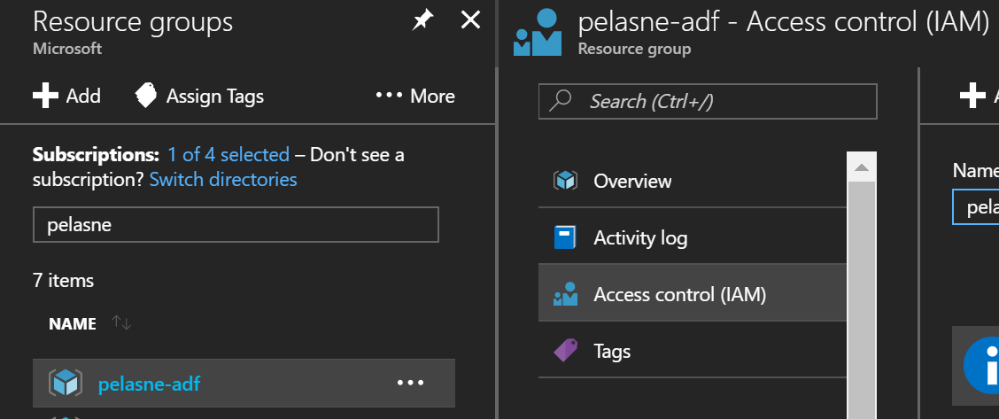
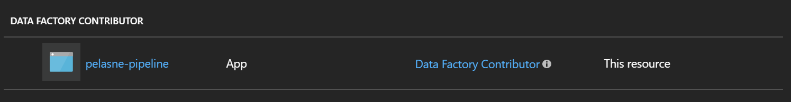

# DevOps Scripts

This section contains a collection of devops scripts that can help with the deployment or maintenance of solutions.

## update.ps1

[update.ps1](update.ps1) is a PowerShell script that:

* looks at all .json files in the current directory, and...
* if they are equal to or later than the specified timestamp, and...
* if they have at least 3 parts to their filename separated by -, and...
* the 3rd part is one of the following: "ls", "ds", or "pl", then...
* the files will be updated in the specified Azure Data Factory.

The parameters are:

* SubscriptionId - The Azure Subscription ID of the subscription containing the ADF.
* ResourceGroup - The name of the Resource Group containing the ADF.
* DataFactory - The name of the Azure Data Factory.
* Since - A timestamp; anything equal to or after this timestamp will be considered for update.

An example:

```bash
.\update.ps1 -SubscriptionId 11111111-1111-1111-1111-1111111111111 -ResourceGroup myrg -DataFactory myadf -Since (Get-Date).AddDays(-3)
```

## update.js

[update.js](update.js) is a Node.js application that does the exact same thing as the above PowerShell script. This is provided in case you need to run on a non-Windows system. There is additional setup required for this solution, so if you can use PowerShell, you should.

The parameters are:

```
-V, --version                 output the version number
-s, --subscription <value>    The Azure Subscription ID of the subscription containing ADF.
-r, --resource-group <value>  The name of the Resource Group containing ADF.
-d, --data-factory <value>    The name of the ADF instance.
-f, --since <value>           A timestamp; files after this time will be considered for upgrade.
-h, --help                    output usage information
```

An example:

```bash
node update.js --subscription 11111111-1111-1111-1111-1111111111111 --resource-group myrg --data-factory myadf --since 2017-01-01T18:00
```

There is one difference in the functionality of this tool vs. the PowerShell tool, it optionally allows you to specify one or more paths on the command line to search. If nothing is specified, it will assume the current directory. An example of this behavior is:

```bash
node update.js --subscription 11111111-1111-1111-1111-1111111111111 --resource-group myrg --data-factory myadf --since 2017-01-01T18:00 . ./latest
```

In that example, both the current directory and a subdirectory called "latest" is searched.

### Create an Azure AD Application

You must create an Azure AD Application for this app to be able to authenticate. To create the application, follow these steps:

1. Go to https://portal.azure.com.

2. Go to the "Azure Active Directory" blade.

3. Go to "App Registrations".

4. Click on "New application registration".

5. Fill out the details as below (the anme and sign-on URL don't matter as long as they are unique).


6. Make note of the "Application ID"; this is the "clientId" you will use in the configuration file below.


7. Click on "Keys".

8. Create a new key and click "Save"; you will then be presented with a key that you must make note of because this will be the "clientSecret" for the configuration file below.


9. On each of the Resource Groups that contains an Azure Data Factory resource that you are trying to expose, you need to grant the Application Account access. In the Resource Group, you will add the permission using the "Access control (IAM)" selection.



10. Give the Application Account the "Data Factory Contributor" permission.



### Configuration

There is a configuration file that must be build for the Node.js application to run. Rename sample.default.json to default.json. Then put in the following information (the other parameters should be left alone):

* directory - This should be the name of the Azure AD that will contain the application created in the previous step.
* clientId - This should be the Application ID from the previous step.
* clientSecret - This should be the Key created in the previous step.
