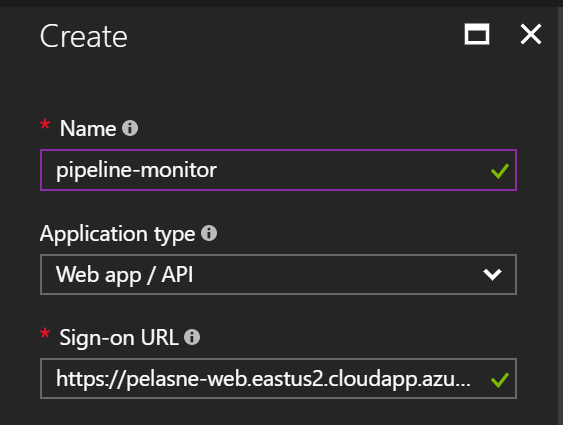
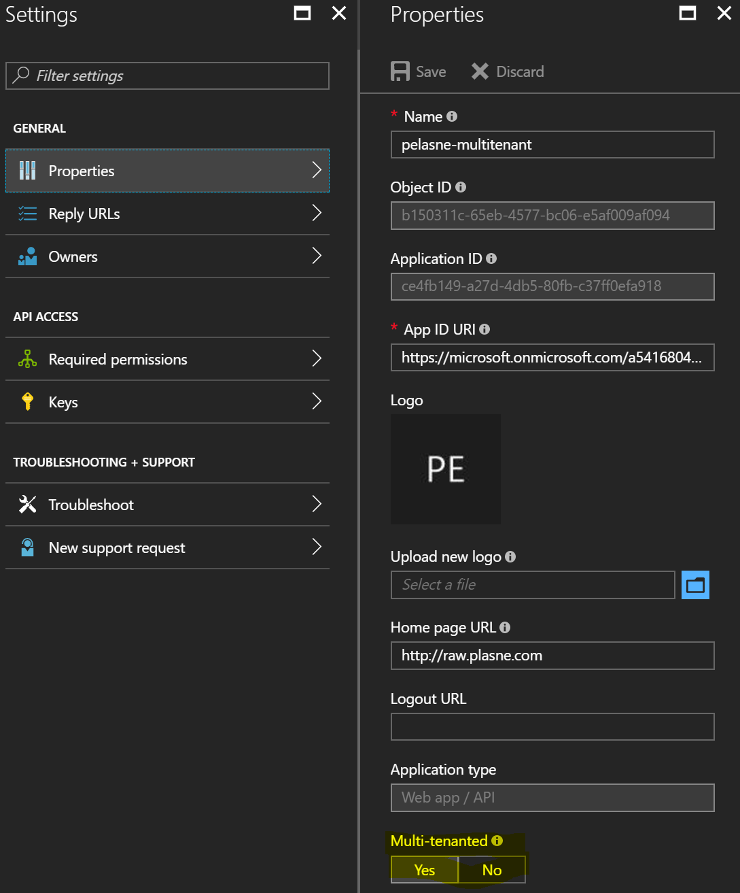
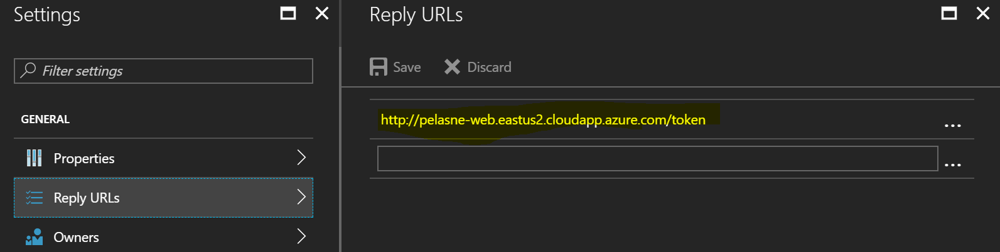
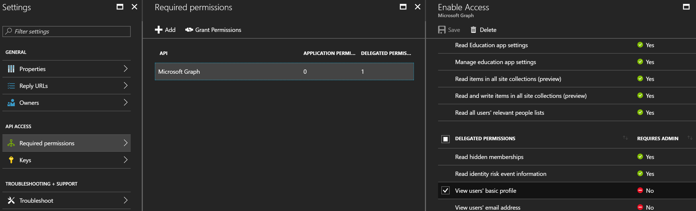

# Pipeline Monitor Portal

The purpose of this portal is to provide a customer with view access to their pipelines running in ADF without having access to the Azure portal or access to other customer's data. In addition, the portal allows customers to download all log files associated with their pipelines.

There are 2 Azure Active Directory Applications you have to create in order for this application to function. The "internal" application has the authority to read the ADF pipeline status and logs. The "external" application is a multitenant application that customers will consent to that gives them the capability of logging into this portal.

## Creating the internal application

To create the internal application:

1. Go to https://portal.azure.com. 

2. Go to the "Azure Active Directory" blade.

3. Go to "App Registrations".

4. Click on "New application registration".

5. Fill out the details as below (the name and sign-on URL don't matter as long as they are unique).


6. Make note of the "Application ID"; this is the "clientId" for the internal application in the configuration file.


7. Click on "Keys".

8. Create a new key and click "Save"; you will then be presented with a key that you must make note of because this will be the "clientSecret" for the internal application in the configuration file.


9. On each of the Resource Groups that contains an Azure Data Factory resource that you are trying to expose, you need to grant the Application Account access.

In the Resource Group, you will add the permission using the "Access control (IAM)" selection.


10. Give the Application Account the "Data Factory Contributor" permission.


## Creating the external application

To create the external application:

1. Go to the "Azure Active Directory" blade.

2. Go to "App Registrations".

3. Click on "New application registration".

4. Fill out the details as below. The name doesn't matter as long as it is unique. The sign-on URL technically doesn't matter (as long as it is unique), but if you put in the Reply URL (step #), then you could skip that step as it will automatically be added.



5. Make note of the "Application ID"; this is the "clientId" for the external application in the configuration file.

6. Click on "Keys".

7. Create a new key and click "Save"; you will then be presented with a key that you must make note of because this will be the "clientSecret" for the external application in the configuration file.

8. Click on "Properties" and change the application to be "Multi-tenanted" and click "Save". This allows administrators of other Azure Active Directories to trust your application so that their users can login.



9. Click on "Reply URLs" and make sure the URL is a fully qualified URL that ends with /token and is reachable over the internet. If it isn't accurate, you can delete it and create a new entry.

This should be the URL that is hosting the server.js file included in this package.



10. Click on "Required permissions", delete any existing permissions, add the following permissions, then "Save":

  * View users' basic profile

This specific right doesn't not require administrative consent, so each individual user can simply consent to use the application.



## Configuration file

In the /config folder is a sample config file (default.sample.json), you should rename that to default.json and put in the variables as so:

* storage - related to the Azure table storage.

  * account - the name of the storage account.

  * key - the key for the storage account.

  * table_instance - the name of the table containing the instance logs.

  * table_customers - the name of the table containing the customer data.

* internal - the account information for reading from ADF.

  * directory - the directory containing the applications you created in the earlier steps.

  * subscriptionId - the subscription ID of the subscription containing the applications you created in the earlier steps.

  * clientId - the clientId of the internal application created above.

  * clientSecret - the clientSecret of the internal application created above.

  * adf_version - the version string for the ADF service calls.

* external - the account information for the multitenant application you created above.

  * clientId - the clientId of the external application created above.

  * clientSecret - the clientSecret of the external application created above.

  * redirectUri - the URL that the user will be redirected to after completing authentication.

  * jwtKey - you can create any key you want, this will be used to sign the JWT that is created with the custom claims after authentication.

  * issuer - the issuer of the JWT; this can be the URL of the portal.

An example configuration looks like this:

```json
{
    "storage": {
        "account": "pelasnepigstore",
        "key": "U...A==",
        "table_instance": "LoadLogs",
        "table_customers": "Customers"
    },
    "internal": {
        "directory": "microsoft.onmicrosoft.com",
        "subscriptionId": "11111111-1111-1111-1111-111111111111",
        "clientId": "22222222-2222-2222-2222-222222222222",
        "clientSecret": "b...4=",
        "adf_version": "2015-10-01"
    },
    "external": {
        "clientId": "33333333-3333-3333-333333333333",
        "clientSecret": "g...s=",
        "redirectUri": "http://pelasne-web.eastus2.cloudapp.azure.com/token",
        "jwtKey": "super-secret-key",
        "issuer": "http://pelasne-web.eastus2.cloudapp.azure.com"
    }
}
```

## Running the application

To startup the application you can type:

```bash
sudo node server.js
```

To keep the application running, you should install forever:

```bash
npm install -g forever
```

And then you can run the application like this:

```bash
sudo forever start server.js
```

## Access Control Lists

Users that log into the portal should not have blanket access to everything. To determine what they should have access to, there is a config.js application that can apply Access Control Lists to a table. This information is then written to the JSON Web Token as a set of claims.

You can use the following to create or overwrite an ACL:

```bash
node config.js --assign --account <account> --customer-id <customer> --rights <list of rights> --resource-group <resource group> --data-factory <data factory> --pipelines <list of pipelines>
```

The parameters are:

* --assign - This is the aciont that will be performed; in this case assigning an ACL.

* --account - This should either be the full name of a account (ex. user@peterlasne.onmicrosoft.com) or a domain (ex. @peterlasne.onmicrosoft.com). This is the scope that the ACL will be applied to. A more specific scope takes precident over a less specific one.

* --customer-id - This is the ID of the customer, it is only used for determining the Instance ID for a log.

* --rights - This should be a single right or a comma-delimited list of rights (in double-quotes) that will be granted to the user.

* --resource-group - This should be the name of the Resource Group containing the ADF that contains the pipelines the user has access to.

* --data-factory - This should be the name of the ADF containing the pipelines that the user has access to.

* --pipelines - This should be a single pipeline name or a comma-delimited list of pipeline names (in double-quotes) that the user should have access to.

An example is:

```bash
node config.js --assign --account @peterlasne.onmicrosoft.com --customer-id HSKY --rights "view, admin" --resource-group pelasne-adf --data-factory pelasne-adf --pipelines "Normalize, Test-Timestamps"
```

In order to view the ACLs that have been assigned, please run 

```bash
node config.js --list
```

## Instance Logs

The LoadFunc creates logs that are referenced by an Instance ID. While the LoadFunc allows you to specify any Instance ID, the monitoring application needs some derivative name. The name convention should be:

* CustomerID-ActivityName-YYYYMMDDTHHmm
