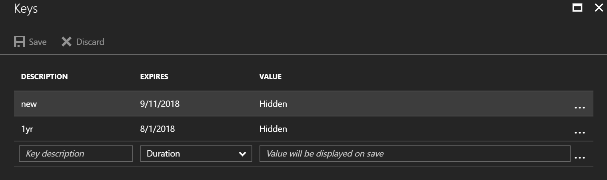

# Pipeline Monitor Portal

The purpose of this portal is to provide a customer with view access to their pipelines running in ADF without having access to the Azure portal or access to other customer's data. In addition, the portal allows customers to download all log files associated with their pipelines.

There are 2 Azure Active Directory Applications you have to create in order for this application to function. The "internal" application has the authority to read the ADF pipeline status and logs. The "external" application is a multitenant application that customers will consent to that gives them the capability of logging into this portal.

## TODO

* figure out why auth isn't working
* add auth header on each endpoint (and read variables from it instead of hardcode)
* populate variables into claims based on user identity (ie. from a database)
* add a config app to populate the table
  * user has access level
  * user has access to list of pipelines
* remove groupPrefix
* finish this documentation

## Creating the internal application

To create the internal application:

1. Go to https://portal.azure.com. 

2. Go to the "Azure Active Directory" blade.

3. Go to "App Registrations".

4. Click on "New application registration".

5. Fill out the details as below (the name and sign-on URL don't matter as long as they are unique).


6. Make not of the "Application ID"; this is the "clientId" for the internal application in the configuration file.


7. Click on "Keys".

8. Create a new key and click "Save"; you will then be presented with a key that you must make note of because this will be the "clientSecret" for the internal application in the configuration file.



9. 

## Creating the external application

## Configuration file

In the /config folder is a sample config file (default.sample.json), you should rename that to default.json and put in the variables as so:

* storage - related to the Azure table storage.

  * account - the name of the storage account.

  * key - the key for the storage account.

  * table_instance - the name of the table containing the instance logs.

  * table_customers - the name of the table containing the customer data.

* internal - the account information for reading from ADF.

  * directory - the directory containing the applications you created in the earlier steps.

  * subscriptionId - the subscription ID of the subscription containing the applications you created in the earlier steps.

  * clientId - the clientId of the internal application created above.

  * clientSecret - the clientSecret of the internal application created above.

  * adf_version - the version string for the ADF service calls.

* external - the account information for the multitenant application you created above.

  * clientId - the clientId of the external application created above.

  * clientSecret - the clientSecret of the external application created above.

  * redirectUri - the URL that the user will be redirected to after completing authentication.

  * jwtKey - you can create any key you want, this will be used to sign the JWT that is created with the custom claims after authentication.

  * issuer - the issuer of the JWT; this can be the URL of the portal.

An example configuration looks like this:

```json
{
    "storage": {
        "account": "pelasnepigstore",
        "key": "U...A==",
        "table_instance": "LoadLogs",
        "table_customers": "Customers"
    },
    "internal": {
        "directory": "microsoft.onmicrosoft.com",
        "subscriptionId": "11111111-1111-1111-1111-111111111111",
        "clientId": "22222222-2222-2222-2222-222222222222",
        "clientSecret": "b...4=",
        "adf_version": "2015-10-01"
    },
    "external": {
        "clientId": "33333333-3333-3333-333333333333",
        "clientSecret": "g...s=",
        "redirectUri": "http://pelasne-web.eastus2.cloudapp.azure.com/token",
        "jwtKey": "super-secret-key",
        "issuer": "http://pelasne-web.eastus2.cloudapp.azure.com"
    }
}
```

## Configuring for external users

* app id
* generate keys
* permissions (graph)
* reply URLs
* consent